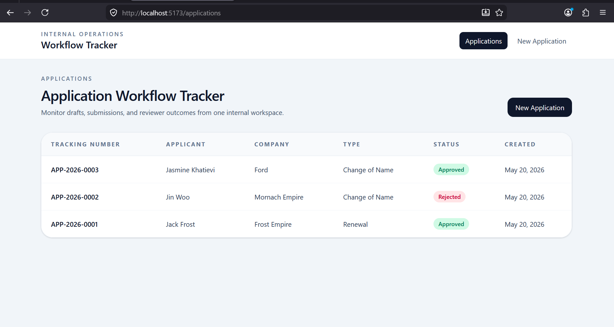
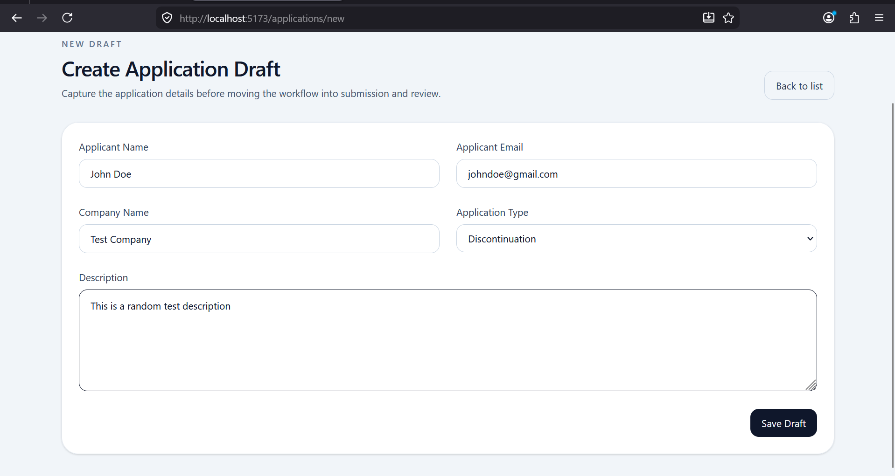
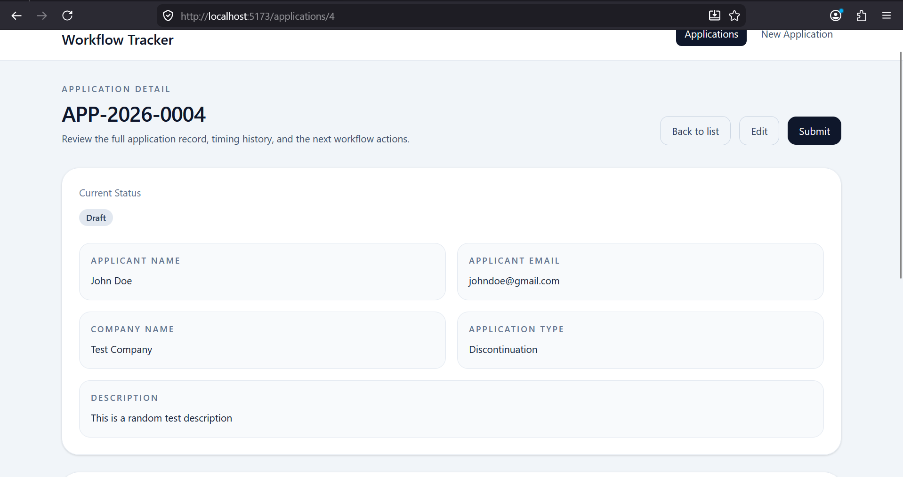
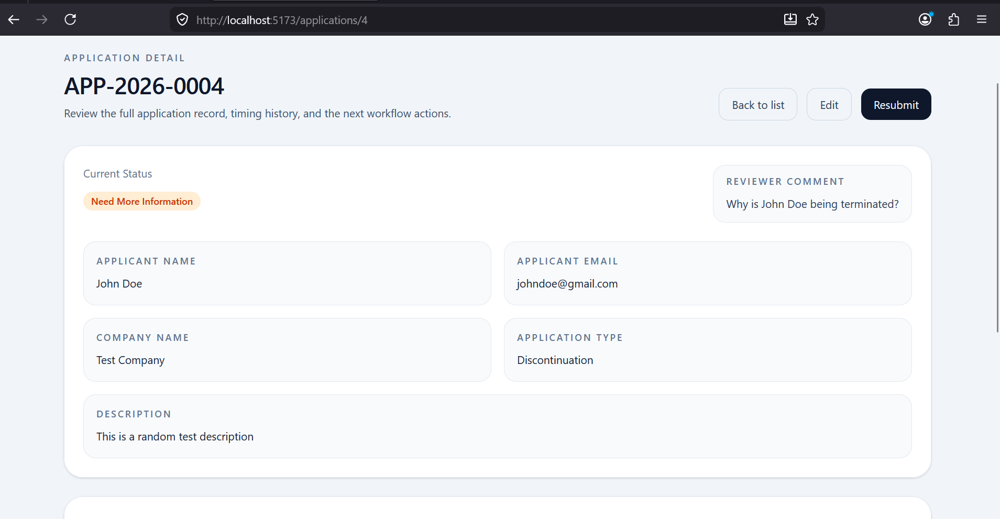

# Workflow Tracker

## Submission Details

**Name:** Loren Deklerk  
**Email:** bidendeclerk@gmail.com


A production-style mini application workflow tracker built with Django, Django Ninja, SQLite, React, Vite, TailwindCSS, Axios, and React Router. It models a small internal operations workflow with clear status transitions, reviewer actions, and draft/edit restrictions.

## Project Overview

This application supports a simple business process for handling internal applications through the following workflow:

- Draft
- Submitted
- Under Review
- Need More Information
- Approved
- Rejected

The implementation keeps workflow rules centralized on the backend and presents a lightweight admin-style interface on the frontend.

## Tech Stack

### Backend

- Python 3.13
- Django
- Django Ninja
- SQLite
- Django ORM
- django-cors-headers
- python-dotenv

### Frontend

- React
- Vite
- TailwindCSS
- Axios
- React Router

## Project Structure

```text
backend/
  applications/
    api.py
    models.py
    schemas.py
    services.py
    utils.py
    validators.py
    migrations/
  config/
  manage.py
frontend/
  src/
    api/
    components/
    hooks/
    pages/
    types/
    utils/
README.md
```

## Setup Instructions

### 1. Clone and enter the project

```powershell
cd "Work Flow Tracker"
```

### 2. Backend setup

Create and activate a virtual environment:

```powershell
py -3.13 -m venv .venv
.\.venv\Scripts\Activate.ps1
```

Install backend dependencies:

```powershell
pip install -r backend\requirements.txt
```

Create a backend environment file:

```powershell
Copy-Item backend\.env.example backend\.env
```

Run migrations:

```powershell
cd backend
python manage.py migrate
```

Start the backend server:

```powershell
python manage.py runserver
```

The backend API will be available at [http://127.0.0.1:8000/api](http://127.0.0.1:8000/api).

### 3. Frontend setup

In a new terminal:

```powershell
cd "Work Flow Tracker\frontend"
npm install
```

Create a frontend environment file:

```powershell
Copy-Item .env.example .env
```

Start the frontend server:

```powershell
npm run dev
```

The frontend will run at [http://127.0.0.1:5173](http://127.0.0.1:5173).

## How to Run Migrations

```powershell
cd "Work Flow Tracker\backend"
python manage.py migrate
```

## API Endpoints

- `POST /api/applications/`
- `GET /api/applications/`
- `GET /api/applications/{id}`
- `PUT /api/applications/{id}`
- `POST /api/applications/{id}/submit`
- `POST /api/applications/{id}/start-review`
- `POST /api/applications/{id}/decision`

## Workflow Rules Implemented

- `Draft -> Submitted`
- `Submitted -> Under Review`
- `Under Review -> Approved`
- `Under Review -> Rejected`
- `Under Review -> Need More Information`
- `Need More Information -> Submitted`
- Only `Draft` and `Need More Information` applications can be edited
- Reviewer comments are required for `Rejected` and `Need More Information`

## Assumptions Made

- Authentication and role-based permissions are intentionally out of scope for this mini app.
- Reviewer actions are triggered from the same UI without a separate reviewer login flow.
- SQLite is sufficient for the local/internal workflow tracker use case.
- Tracking numbers reset sequence by calendar year.
- Python 3.13 is the target backend runtime because the local Python 3.14 environment may not resolve Django Ninja dependencies cleanly yet.

## Future Improvements

- Add authentication and role-based permissions for applicants and reviewers.
- Add filtering, search, and pagination on the list view.
- Improve tracking number generation for high-concurrency production deployments.
- Add backend tests and frontend component/integration tests.
- Add audit history for every workflow transition.

## Screenshots

### Application List

Shows the main operations view with tracking number, applicant, company, application type, status, and created date.



### Create Application Form

Shows the draft creation form used to capture applicant details, company information, application type, and description.



### Application Detail

Shows the application detail page with status, reviewer comments, timeline information, and contextual workflow actions.



### Need More Information State

Shows the workflow after a reviewer requests more information, including the reviewer comment and resubmission path.



## Notes

- The repository includes a hand-authored initial migration at `backend/applications/migrations/0001_initial.py`.
- Environment variable examples are provided at `backend/.env.example` and `frontend/.env.example`.
- If dependency installation is blocked in your environment, install steps may need network access before runtime verification can succeed.
